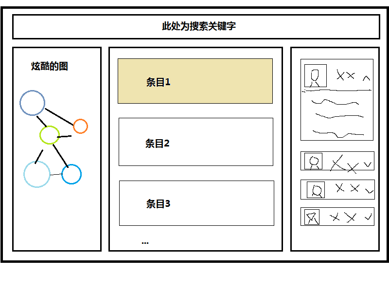

#KGrelate
-- Knowlege Graph project's relate info part.
##前端整体页面结构
经过开会商议，整体的页面结构差不多是下面这个样子的：

我们要做的就是右边的部分，即点开一个条目后，应当给出相关的信息。(示意图中只画了相关人物，实际上还有相关论文，可能还会有其他)
##需求
用户点击一个条目后，我们应当在调用后端查找相应信息，并在右侧部分列出一个列表。一开始只显示照片和概要信息，当用户点击列表项时，会列出更详细的信息。并且这些信息中的很多(比如人物相关的研究领域关键词)也可以点击，点击后整个页面都将改变。
##界面设计
每个列表项的左侧为人物的照片，中间为姓名、职务等概要信息，右侧是一个箭头，点击箭头可以展开/收缩。(结果css交给图表组实现了)
##实现的初步设计
###前端部分
####整体设计
将所有操作包装成一个类(prototype)。我们给前端一个id，比如info，他们只需要建立一个id为info的div并创建一个这个类的对象，然后直接调用类的函数。使用类的时候，函数会直接改变这个div的内容。为了方便他们使用，这个类的函数可以都有callback。
####接口
类名为InfoManager，假设我们开了一个实例叫做im  
#####外部使用的接口
* 读取某个关键词的相关信息：  
 + 读取人物和论文  
im.load(keyword, [options]);  
 + 读取论文  
im.loadPubs(keyword[, options]);  
 + 读取人物  
im.loadPeople(keyword[, options]);  

* 清空列表：  
im.dom.empty();

####关系网络数据结构
```
 1. 节点类别
 eg: ['a', 'b', 'c']
 
 2. 节点数据
 eg: [
        {category:0, name: 'aaa', value : 10},
        {category:1, name: 'bbb',value : 2},
        {category:1, name: 'ccc',value : 3},
        {category:1, name: 'ddd',value : 3},
        {category:2, name: 'eee',value : 5},
        {category:2, name: 'fff',value : 8},
        {category:3, name: 'ggg',value : 1},
    ]
category表示所属类别，name表示节点名称，value表示节点权重（权重越大对应节点大小越大）

3. 边数据
eg: [
        {source : 'aaa', target : 'bbb', weight : 10},
        {source : 'aaa', target : 'ccc', weight : 2},
        {source : 'bbb', target : 'ccc', weight : 1},
        {source : 'aaa', target : 'ddd', weight : 2},
        {source : 'aaa', target : 'eee', weight : 3},
        {source : 'aaa', target : 'fff', weight : 1},
        {source : 'ccc', target : 'ddd', weight : 8, name: 'xxx'},
        {source : 'ccc', target : 'eee', weight : 8, name: 'xxx'},
        {source : 'ddd', target : 'eee', weight : 8, name: 'xxx'},
        {source : 'ggg', target : 'aaa', weight : 8, name: 'xxx'},
        {source : 'ggg', target : 'ccc', weight : 8, name: 'xxx'},
        {source : 'ggg', target : 'ddd', weight : 8, name: 'xxx'},
    ]
source表示源节点，target表示目标节点，weight表示边权（边权越大连线越长），name表示关系说明，为可选参数。
```

###后台部分
####整体设计
用flask框架搭建。  
收到前端的请求后，后台向Aminer发出GET请求，调用AMiner的API，然后将结果返回前台页面(包括概要信息和详细信息)。  
####接口
#####返回信息API
* 论文：/pubs/&lt;name&gt;  
* 人物：/people/&lt;name&gt;  
* 概念：/entity/&lt;name&gt;  

返回json格式的数据  

#####json数据信息
* 论文：  
title, (title_zh), authors, venue, year, n_citation, keywords, id, url, 
detail->{abstract, (abstract_zh)}  

* 人物：  
name, (name_zh), image, org, (org_zh), tags, h_index, n_pubs, n_citation, id,
detail->{similarPersons->{name, image}, contact->{position, phone, email, fax, affiliation, address, interest, edu, work, bio, homepage, avatar}}

注：由于可能返回多个人物结果，故将结果封装成一个list内部每一个人物封装成一个dict，接口如上，另外，在初步设计外添加一个新字段id，目的是设置人物的为一标识，以便调用similarPersons和contact进行区分和匹配

contact example:  
>     "contact": {
        "position": "Associate Professor",
        "phone": "+8610-62788788-20 ",
        "email": "jietang@tsinghua.edu.cn",
        "fax": "+8610-62794365",
        "affiliation": "Department of Computer Science and Technology, Tsinghua University, China",
        "address": "FIT 1-308, Tsinghua University, Beijing 100084, China PR",
        "interest": "",
        "edu": "2006, Tsinghua University, Ph.D..",
        "work": "2011",
        "bio": "I am an associate professor in Department of Computer Science and Technology of Tsinghua. I obtained my Ph.D. in DCST of Tsinghua University in 2006. I became ACM Professional member in 2006 and IEEE member in 2007. My research interests include social network analysis, data mining, machine learning, and semantic web. \n\nI have been visiting scholar at Cornell University (working with John Hopcroft), University of Illinois at Urbana-Champaign (short term, working with Jiawei Han), Chinese University of Hong Kong (working with Jeffrey Yu), and Hong Kong University of Science and Technology (working with Qiong Luo). During my graduate career, I have been an intern at NLC group of Microsoft Research Asia from 2004 to 2005. I also have attended the internship program of IBM China Research Lab in 2004.",
        "homepage": "http://keg.cs.tsinghua.edu.cn/jietang/",
        "avatar": ""
      },
      
* 概念：  
title->{ch, en}, image[0], 
detail->{url(?), image[], abstract->[ch, en], super_topic[]->{ch, en}, related_item[]->{image, title->{ch, en}}, type(tag)[]->{ch, en}}
